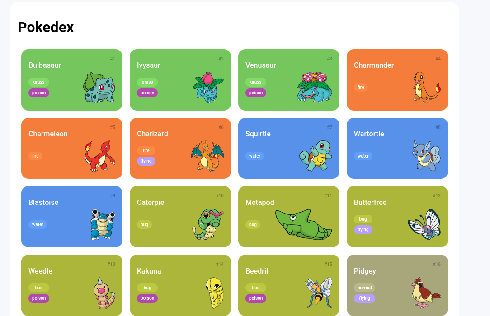
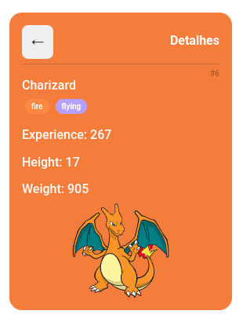

# Trilha JS Developer - Pokedex

Desafio de código feito por Tiago Felix Prudente
Seguindo os arquivos base do projeto 'Construindo uma Pokédex com JavaScript'

### Criado modal de detalhe ao clicar sobre o card do pokemon desejado!

